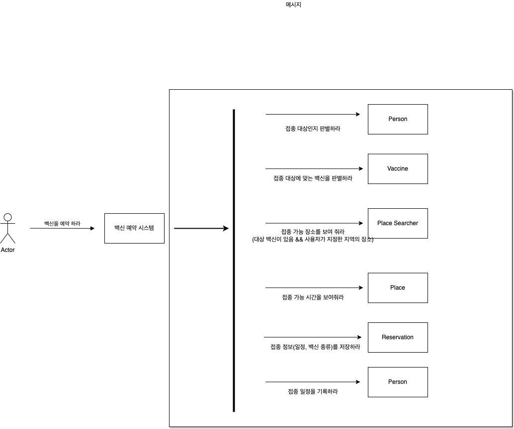
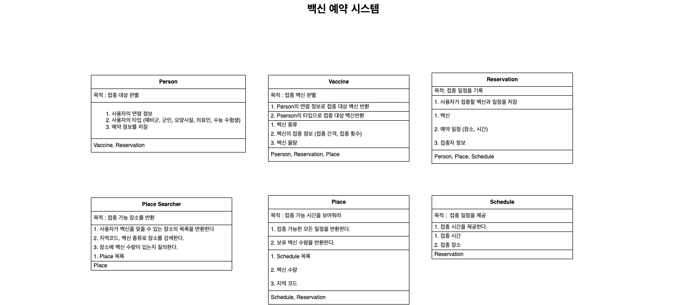
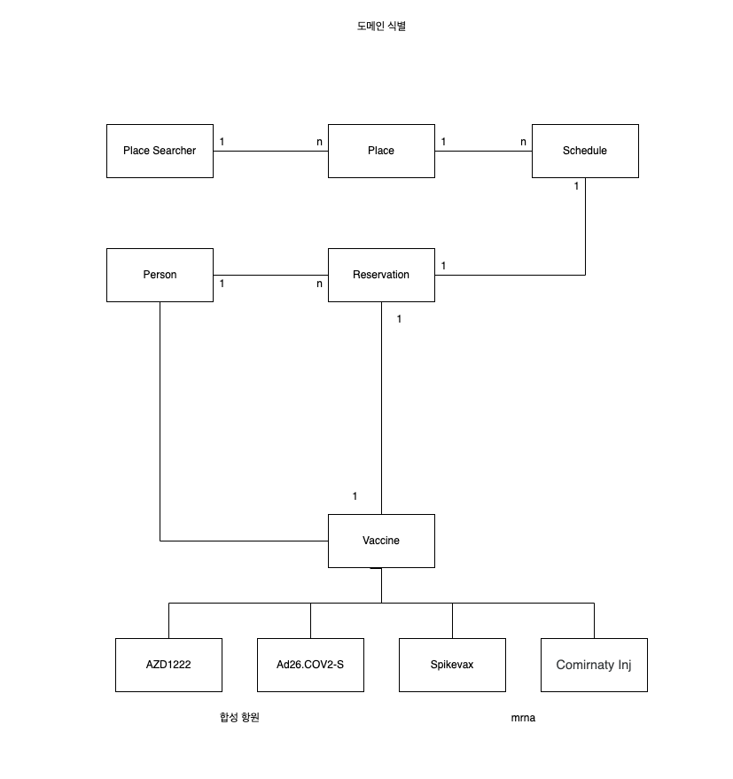

## 백신 예약 시스템

### 요구 사항
1. 코로나 19의 집단 면역을 위한 전국민 대상 백신 예약 시스템 구현
2. 백신의 종류에 따라 접종이 달라짐
   1. 접종 간격
   2. 접종 횟수
3. 백신 수량에 따라 2차 백신 종류가 달라질 수 있음
4. 접종 대상자
   1. 우선 접종 대상 (고위험, 고령, 요양원, 의료인, 군인, 예비군, etc)
   2. 만 19 이상
5. 예약 종류
   1. 백신 예약
   2. 잔여 백신 예약

### 협력 (문맥)
백신 예약

### 책임
1. 백신을 예약한다.
    - 접종 대상인지 판별한다.
    - 접종 백신을 판별한다.
    - 접종 가능 장소를 알려준다.
    - 접종 가능 시간을 알려준다.
    - 접종자가 시간을 선택해서 확정하면 일정이 저장된다.

### 메시지
- 백신을 예약하라
- 접종 대상인지 판별하라
- 접종 대상 백신을 판별하라
- 접종 가능 장소를 알려줘라
- 접종 가능 시간을 알려줘라
- 접종 정보(일정, 백신 종류)를 저장하라
- 접종 일정을 기록하라

### 메시지 객체 할당

### CRC 식별

### 도메인 식별

